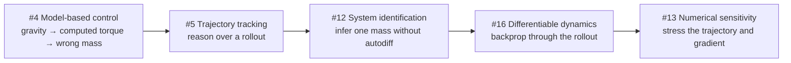
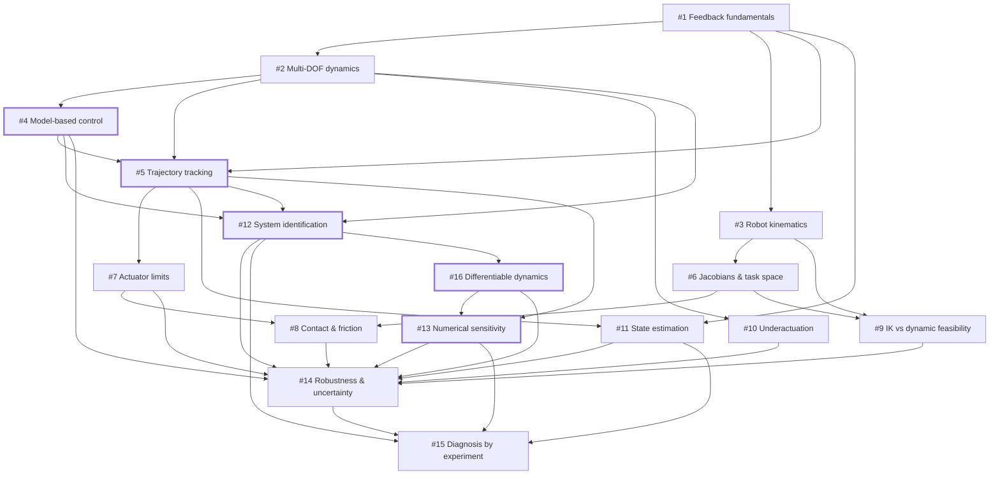

# Robotics Test Bench

A disposable laboratory for building robotics intuition through small simulation experiments.

The goal is to shorten the distance between a physical question and an observation. This is not a polished robotics project.

## Core loop

1. State a question.
2. Make an Iteration 0 prediction.
3. Build the smallest useful test.
4. Run it.
5. Observe the result.
6. Update the mental model.
7. Record the next question.

Agents should remove setup, API, boilerplate, and repetitive implementation friction. The human should own prediction, physical interpretation, and diagnosis when those are the learning target.

## Structure

```text
experiments/
  YYYY-MM-DD-short-question/
    README.md
    <experiment code>
    agent-log.md

templates/
  agent-interaction.md
```

Each experiment owns its code and local evidence. Root docs contain only repo-wide conventions.

## Concept map

GitHub issues are concept nodes, not a fixed syllabus. Node numbers below match issue numbers. Arrows mean that one concept can make another experiment more meaningful; they do **not** mean that the nodes must be completed in order.

Choose the next node from the evidence produced by the current experiment. Branch, repeat, skip, or insert a smaller local question when the observations justify it.

### Active evidence route

The current model-based-control work has exposed a useful route toward differentiable dynamics. Follow it only while each experiment keeps producing the next question shown here.



The first stop is still the current #4 experiment. Close the gravity-compensation telemetry question before moving forward. The route becomes invalid as soon as stronger evidence points elsewhere.

### Full map



The map is intentionally incomplete as a path planner. The core loop remains authoritative: an experiment should end by producing the next question, even when that question points sideways or backward in the graph.

## Small ontology

Meaningful agent interactions use stable local objects:

```text
Question -> Response -> Evaluation -> Action -> Outcome
   Q          R           E           A          O
```

Each object gets a stable ID such as `Q-20260808-001`. The experiment `agent-log.md` records the object summaries, relations, evidence status, unresolved questions, and a compact Librarian handoff. The ontology is an audit layer, not a reason to log routine syntax help or full conversations.

Use three layers for reconstruction:
- `agent-log.md` preserves changes in belief.
- commit messages translate the belief, evidence, or decision into the reason for a code change.
- the Git diff preserves the exact implementation.

Record implementation details in the reasoning trace only when they changed a prediction, explanation, diagnosis, decision, evidence interpretation, or next question. Do not use agent logs as implementation changelogs. Commit messages should explain why a code change follows from the current evidence, not merely restate the files changed.

Use [`templates/agent-interaction.md`](templates/agent-interaction.md) for the canonical shape.

## Current experiment

[`experiments/2026-08-09-model-based-control`](experiments/2026-08-09-model-based-control)

Current learning boundary: connect the gravity-compensation error-dynamics explanation to measured `tau_g`, `tau_fb`, tracking error, and total torque. Do not add computed torque until that evidence is recorded.

MuJoCo mental model:
- `mjModel` = what the simulated system is.
- `mjData` = what the system is doing now.
- `worldbody` = fixed global frame.
- bodies form a tree; contacts and constraints add relationships beyond that tree.
- `qpos` = generalized configuration.
- `qvel` = generalized velocity.
- `ctrl` = actuator command, not necessarily joint torque.
- `mj_step()` advances kinematics, contact/constraints, forces, acceleration, and integration.

## Rules

- Run something quickly.
- Change one meaningful variable at a time when causality matters.
- Predict before executing.
- Optimize for understanding, not elegance.
- Ugly experiment code is acceptable.
- Refactor only when it removes repeated friction or enables the next question.
- Keep reasoning traces epistemic: record belief changes, not routine code chronology.
- Write commit messages as the bridge from belief or evidence to the resulting code change.
- Do not turn this repo into a general robotics encyclopedia.

## Success metrics

Measure questions tested, predictions made, surprising failures, observations, and updated beliefs. Do not optimize for lines of code or production polish.
