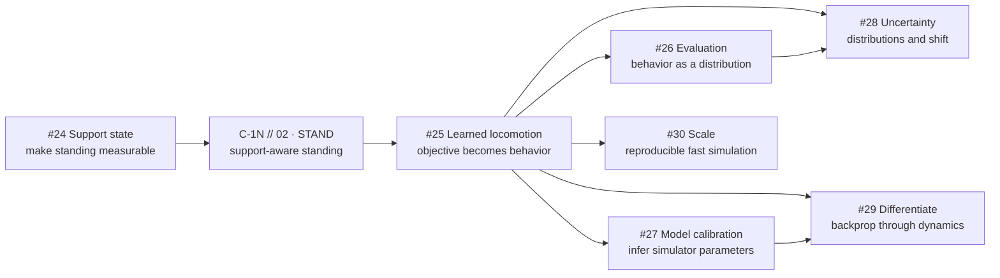

# Robotics Test Bench

A disposable laboratory for learning robotics through small simulation experiments.

The goal is to shorten the distance between a physical question and evidence, then use that understanding to move deeper into simulation, statistical modeling, robot learning, and evaluation.

## Core loop

1. State a question.
2. Make an Iteration 0 prediction.
3. Build the smallest useful test.
4. Run it.
5. Observe the result.
6. Update the mental model.
7. Let the failure choose the next question.

Agents should remove setup, API, boilerplate, repetitive implementation, plotting, and experiment plumbing. The human should own prediction, physical interpretation, objective design, and diagnosis when those are the learning target.

## Direction

This bench is simulation-first.

Physics and controls are required literacy because the simulator must represent a physical system. They are not the assumed professional endpoint. Hardware is useful external ground truth when available, but owning hardware or routing into hardware work is not a graduation requirement.

The long-term technical center is:

`software systems + statistics + physical simulation + optimization + robot learning`

The bench should increasingly lean into:

- measurable task definitions;
- rollout distributions and uncertainty;
- system identification and simulator calibration;
- policy optimization and learned behavior;
- distribution shift and robustness;
- differentiable dynamics;
- numerical fidelity;
- reproducible and scalable simulation infrastructure.

## Active frontier

`TODO.md` is authoritative. The current route is:



This is not a fixed syllabus after `STAND`. Learned locomotion is a forcing function. Its failures should pull in the next useful lane.

Controls, contact mechanics, actuator limits, estimation, numerical integration, or other mechanics topics can re-enter when a concrete simulation failure requires them. Do not maintain speculative prerequisite paths.

## Issue policy

Open GitHub issues represent the current frontier only.

Legacy concept issues are closed and remain historical provenance. Do not reopen or reproduce the old concept graph by default. Create or revive a focused issue only when current evidence exposes a real blocker.

Issue numbers are stable identities, not chronology. Dated experiment directories and commits preserve chronology.

## Structure

```text
TODO.md
experiments/
  telemetry.py
  YYYY-MM-DD-short-question/
    README.md
    <experiment code>
    agent-log.md
integrations/
  c1n.md
templates/
  agent-interaction.md
```

Each experiment owns its code and local evidence. Root docs contain only repo-wide conventions.

## Viewer telemetry

Use [`experiments/telemetry.py`](experiments/telemetry.py) for rolling MuJoCo viewer graphs. Keep experiment-specific metrics and labels in the experiment. Keep shared graph construction, history, layout, and palette in `telemetry.py`.

As the frontier moves into statistical simulation, prefer structured metrics that can also be consumed headlessly across seeds, scenarios, parameter draws, and policy checkpoints. A viewer is evidence for mechanism inspection, not the only evaluation surface.

## C-1N

C-1N is the longitudinal integration robot in `haidmoham/spider`.

Public checkpoints use:

```text
C-1N // NN · CODENAME
```

Current lineage:

```text
C-1N // 00 · POSE     historical motor-assisted static-pose baseline
C-1N // 01 · SHUFFLE  current coordinated gait failure
C-1N // 02 · STAND    reserved: first support-aware stable stance
C-1N // 03 · STRIDE   reserved: first materially better sustained walk
```

The immediate foundation is still standing. Issue #24 isolates support and turns standing into a measurable rollout condition. After that concept closes, transfer it to C-1N and earn `STAND` before learned locomotion becomes the main forcing function.

After `STAND`, C-1N becomes primarily a simulation subject for policy learning, evaluation, calibration, uncertainty, differentiable dynamics, and experiment scaling. See [`integrations/c1n.md`](integrations/c1n.md).

## Small ontology

Meaningful agent interactions use stable local objects:

```text
Question -> Response -> Evaluation -> Action -> Outcome
   Q          R           E           A          O
```

Use `agent-log.md` only for interactions that change a prediction, interpretation, decision, experiment, or next action. Preserve stable IDs and source provenance. Do not store full chat transcripts.

Use three layers for reconstruction:

- `agent-log.md` preserves changes in belief;
- commit messages explain why evidence or a decision caused a code change;
- the Git diff preserves the implementation.

Use [`templates/agent-interaction.md`](templates/agent-interaction.md) for the canonical record shape.

## MuJoCo mental model

- `mjModel` = what the simulated system is.
- `mjData` = what the system is doing now.
- `worldbody` = fixed global frame.
- `qpos` = generalized configuration.
- `qvel` = generalized velocity.
- `ctrl` = actuator command, not necessarily joint torque.
- contacts and constraints add relationships beyond the body tree.
- `mj_step()` advances kinematics, contact/constraints, forces, acceleration, and integration.

## Rules

- Run something quickly.
- Predict before executing when the mechanism is the learning target.
- Change one meaningful variable at a time when causality matters.
- Define objectives and evaluation conditions explicitly.
- Prefer distributions over cherry-picked rollouts when comparing behavior.
- Validate fitted or learned quantities on behavior not used to fit them.
- Preserve useful failures.
- Optimize for understanding, not elegance.
- Add infrastructure only when a real experiment needs it.
- Do not polish an experiment after its learning value is exhausted.

## Success metrics

Measure questions tested, predictions made, surprising failures, updated beliefs, reproducibility, validation quality, and increasingly strong simulation experiments.

Do not optimize for lines of code, visual polish, or proximity to hardware.